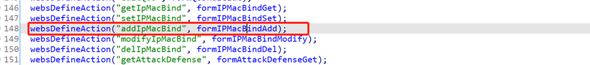
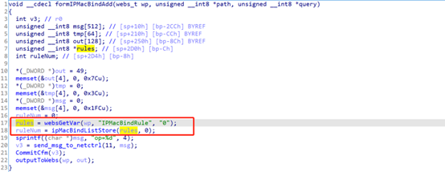
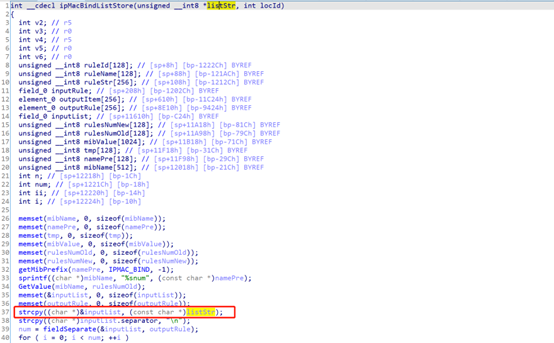

# W15E buff overflow vulnerability
Vendor: Tenda W15E Version: US_W15EV1.0br_V15.11.0.13(1068_1523_841)_CN_TDC

Description：There is a buff overflow vulnerability in W15E router. The function is 0x00068CA0. Rules gets the content of IPMacBindRule and uses the strcpy without check the length, which result in buffer overflow.

