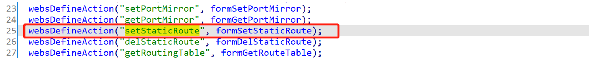
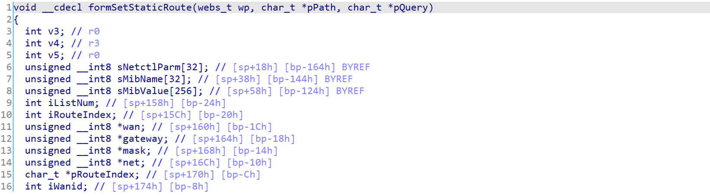
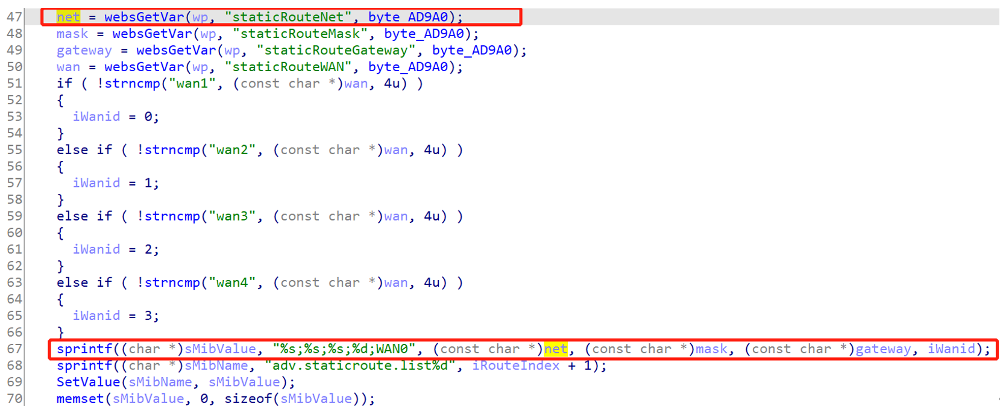

# W15E buff overflow vulnerability
Vendor: Tenda W15E   
Version: US_W15EV1.0br_V15.11.0.13(1068_1523_841)_CN_TDC

Description：There is a buff overflow vulnerability in W15E router. The function is 0x0004B41C. Net gets the content of staticRouteNet and uses the sprintf without check the length, which result in buffer overflow.

