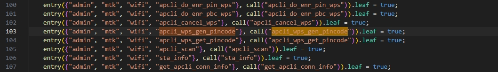
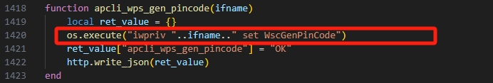
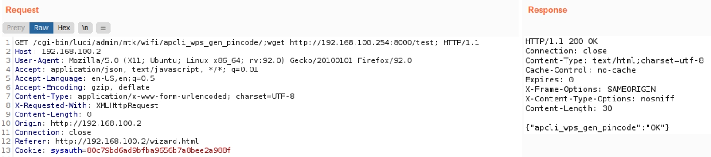
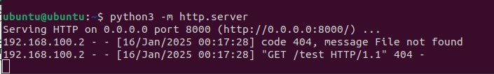

# Command injection vulnerability in apcli_wps_gen_pincode function  

Vendor: Totolink  
Version: X5000R (latest version)  
Detail: There is a command injection vulnerability in apcli_wps_gen_pincode function in mtkwifi.lua  

We use Burpsuite to attack, the effect is as follows.

