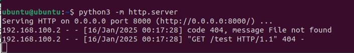

# Command injection vulnerability in vif_enable function  

Vendor: Totolink  
Version: X5000R (latest version)  
Detail: There is a command injection vulnerability in vif_enable function in mtkwifi.lua  

We use Burpsuite to attack, the effect is as follows.

