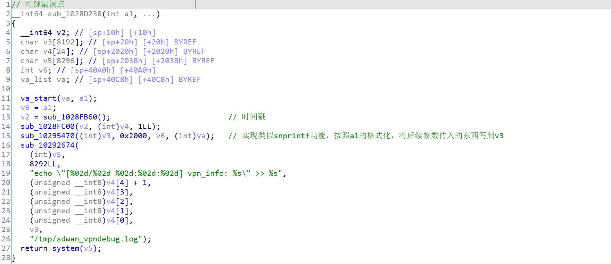
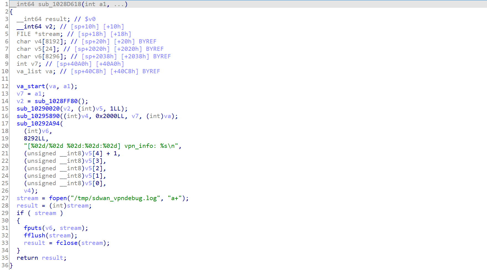
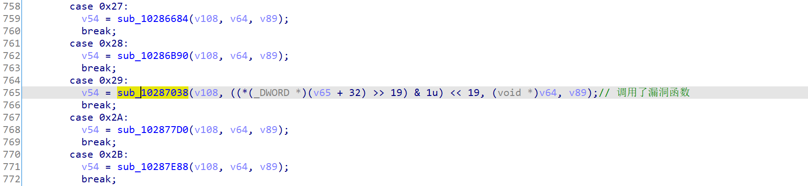
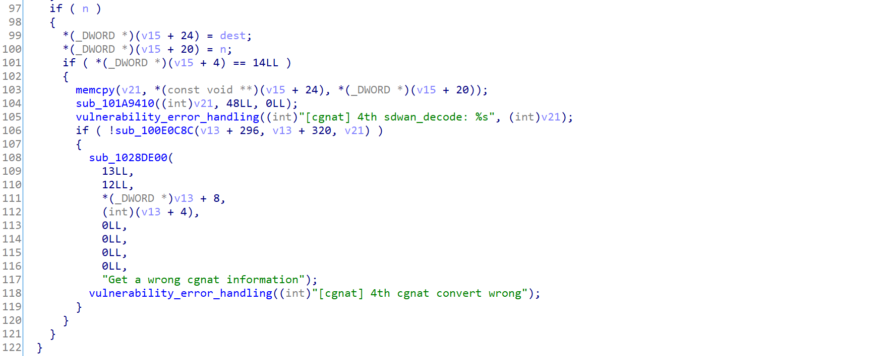
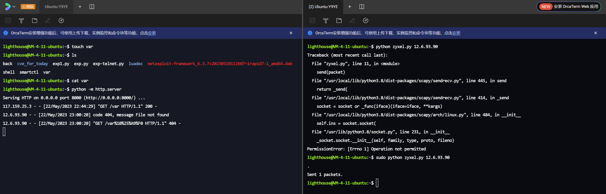

# Zyxel unauthorized cmd injection vulnerability

A command-injection vulnerability exists in the Zyxel Firewall Series Appliance (ZyWALL)/sbin/sshipsecpm file sub_1028D238 function. The function functions to output error messages through the system, and when the user constructs an error packet in a specific format, command injection can be achieved through this function.

The use example of the vulnerability is as belows:

